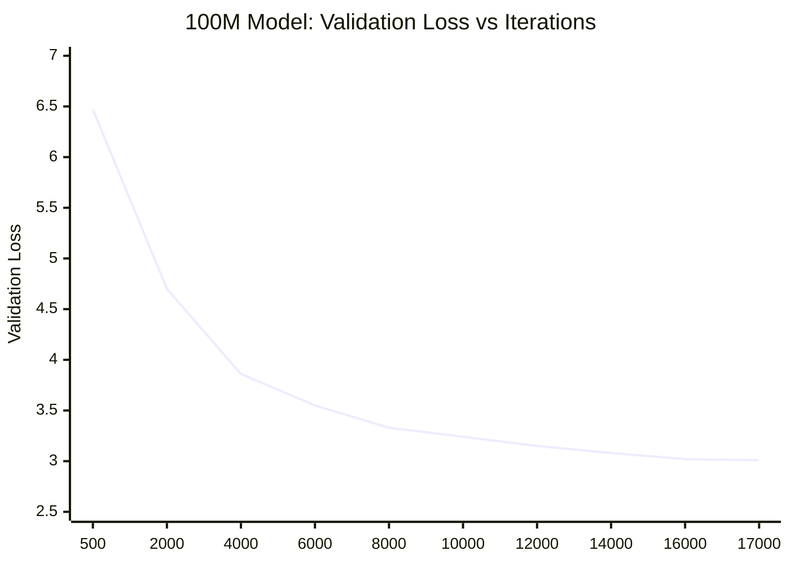
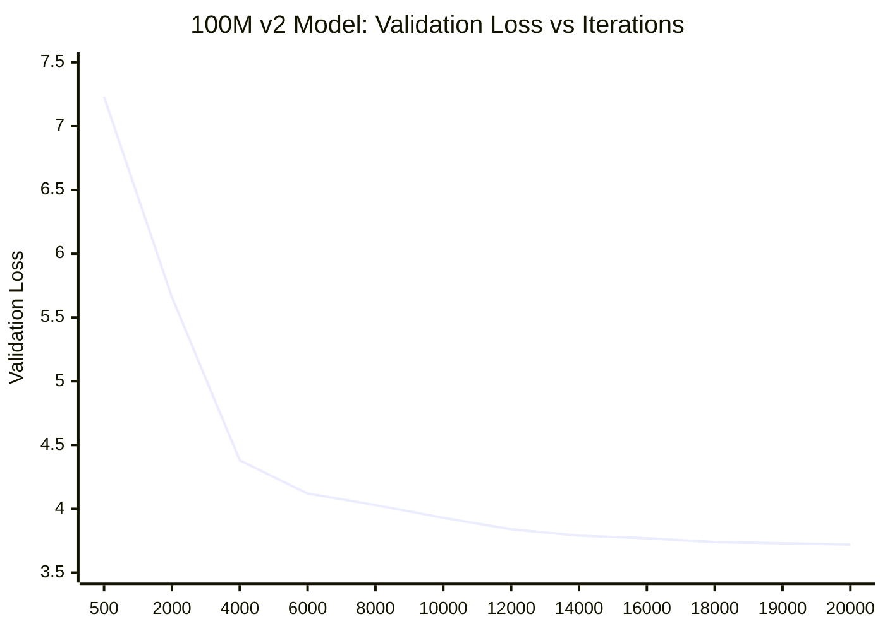
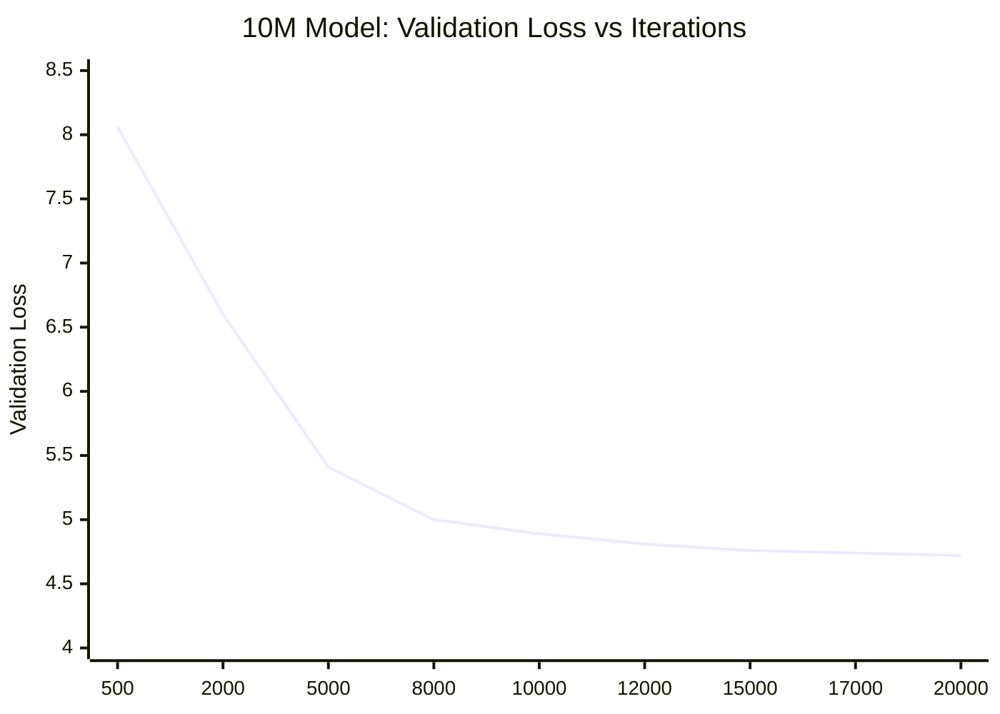

# Training NanoZhGPT: Building a 100M Parameter Chinese Language Model

A few weeks ago, I came across a Zhihu article where someone trained a 3M parameter Chinese LLM with decent results. That sparked an idea: why not try training my own? What started as a modest 10M parameter goal eventually evolved into a 100M parameter model.

<!--more-->

## Dataset and Tokenizer

**Dataset**: C4 Chinese portion, ~67GB  
**Tokenizer**: Byte-level BPE, 50K vocabulary

I spent a long time debugging HF's Tokenizer Trainer. Every run ended the same way: either out of memory or stuck indefinitely during preprocessing. The HF Datasets pipeline would consume massive RAM and never complete on 67GB of data.

After countless failed attempts, I finally decided to write a C++ trainer from scratch—pure vibe coding session. The result: a custom Byte-Level BPE trainer that handles large-scale data efficiently.

**Technical details of the C++ trainer:**
- Uses `xmake` build system with zlib compression support
- Reads data paths from `.env` file (supports json/json.gz glob patterns)
- Implements chunk-based processing for resume capability
- Outputs per-chunk files to `chunks/` directory
- Configurable chunk grouping via `--chunk-files N`
- Force rebuild option with `--no-resume`

```cpp
// Custom C++ Byte-Level BPE Trainer
// Build: xmake f -m release && xmake
// Run: xmake run byte_bpe_train --output tokenizer.json
// Resume support: chunks/ directory stores intermediate state
```

The C++ version completed in a fraction of the time with minimal memory footprint.

## Training Framework

When I started this project, I wasn't familiar with frameworks like PyTorch Lightning. This meant implementing everything from scratch: the training loop, checkpoint saving/loading, gradient accumulation, mixed precision, and validation logic.

Building the framework myself gave me deep insights into how these systems work, but it also consumed significant engineering time. The implementation includes:
- Checkpoint management with metadata tracking
- Gradient checkpointing for memory efficiency
- Automatic OOM recovery with batch size reduction
- XPU/CUDA memory monitoring and logging
- Streaming data loader with prefetching and RAM caching

```bash
# Training command example
python train/train_xpu.py \
  --data-dir data/tokens \
  --out-dir checkpoints/gpt100m \
  --seq-len 1024 \
  --n-layer 14 --n-head 10 --n-embd 640 \
  --batch-size 2 --grad-accum 16 \
  --gradient-checkpointing --oom-auto-reduce
```

## Training Time and Compute

All models were trained on local XPU except the 300M model, which I'm currently training on rented AutoDL GPU cloud compute.

| Model  | Params | Seq Len | Training Time | Compute    |
|--------|--------|---------|---------------|------------|
| 10M    | ~10M   | 1024    | ~8 hours      | Local XPU  |
| 100M   | ~100M  | 1024    | ~24 hours     | Local XPU  |
| 100M v2| ~100M  | 2048    | ~36 hours     | Local XPU  |
| 300M   | ~300M  | 2048    | ~82 hours*    | AutoDL GPU |

*300M Still in progress*

The 300M model features extended context length and is my largest training experiment so far.

Here is GPT300M train code

```bash
python train/train_xpu.py --data-dir data/tokens --out-dir checkpoints/gpt300m --device cuda --dtype bf16 --gradient-checkpointing --min-batch-size 1 --seq-len 8192 --n-layer 20 --n-head 16 --n-embd 1024 --batch-size 4 --grad-accum 16 --prefetch-batches 32 --shards-per-batch 1 --ram-cache-gb 32 --max-iters 20000 --compile
```

## Training Results

### 100M Model (seq_len=1024)



**Best checkpoint**: Iteration 17,000  
**Best val_loss**: 3.007 (ppl: 20.23)

### 100M v2 Model (seq_len=2048)



**Best checkpoint**: Iteration 19,000  
**Best val_loss**: 3.728 (ppl: 41.59)

**Note**: Training showed instability with NaN losses at iterations 4,500 and 7,500. Despite doubled sequence length (2048 vs 1024), the model achieved higher validation loss than the original 100M, suggesting training instability or different data sampling affected convergence.

### 10M Model (seq_len=1024)



**Best checkpoint**: Iteration 20,000  
**Best val_loss**: 4.715 (ppl: 111.65)

### Model Comparison

| Model  | Params | Seq Len | Best Iter | Val Loss | Perplexity |
|--------|--------|---------|-----------|----------|------------|
| 100M   | ~100M  | 1024    | 17,000    | 3.007    | 20.23      |
| 100M v2| ~100M  | 2048    | 19,000    | 3.728    | 41.59      |
| 10M    | ~10M   | 1024    | 20,000    | 4.715    | 111.65     |

## Key Observations

1. **Sequence length trade-off**: 100M v2 (seq_len=2048) achieved worse loss (3.728) than 100M (seq_len=1024, loss 3.007). Training instability with NaN losses at iterations 4.5K and 7.5K suggests longer sequences may require different hyperparameters.

2. **C++ tokenization issue**: After switching to C++ token processing, training performance degraded despite faster data loading.

3. **Loss vs quality gap**: Good validation loss didn't translate to impressive generation quality.

4. **Training dynamics**: The 10M model showed smoother, more predictable convergence than 100M variants.

## Engineering Insights

**Pipeline Scalability**: High-level abstractions encountered memory bottlenecks with 67GB+ corpora. A custom C++ tokenizer with chunked I/O resolved throughput constraints and enabled resumable preprocessing.

**Metric Correlation**: Validation loss convergence did not linearly correlate with generative quality in the <100M regime. Quantitative metrics require supplementation with qualitative evaluation.

**Infrastructure Trade-offs**: Custom training loops provide granular control over checkpointing and mixed precision but increase engineering overhead. Established frameworks may better support architecture experimentation.

**Scaling Stability**: Transitioning to 100M parameters introduced instability (e.g., NaN losses). Larger configurations necessitate refined hyperparameter tuning, including gradient clipping and learning rate schedules.

**Compute Elasticity**: Cloud GPU resources facilitated scaling beyond local XPU limits, highlighting the importance of elastic infrastructure for iterative development.

## What's Next

Planning an English-only model with architectural improvements:
- Different attention mechanisms
- Better normalization strategies  
- Longer context lengths
- Learning from Lightning and other frameworks

The 100M milestone is a good stopping point for this iteration. The 300M model training on AutoDL will provide more insights into scaling. The process of building everything from scratch—from tokenizer to trainer to evaluation—has been incredibly educational.

Sometimes the best way to understand how something works is to build it yourself, bugs and all.

The 100M milestone is a good stopping point. The model won't win benchmarks, but building it—from tokenizer to trainer to evaluation—taught me more than any tutorial could.

---

**Technical Stack**:
- Tokenizer: Custom C++ Byte-level BPE (50K vocab)
- Training: PyTorch on XPU, bfloat16, gradient checkpointing
- Dataset: C4 Chinese (~67GB)
- Code: Available on GitHub

